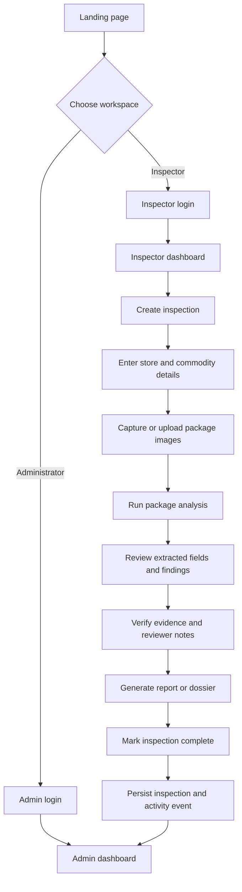
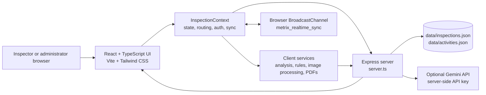
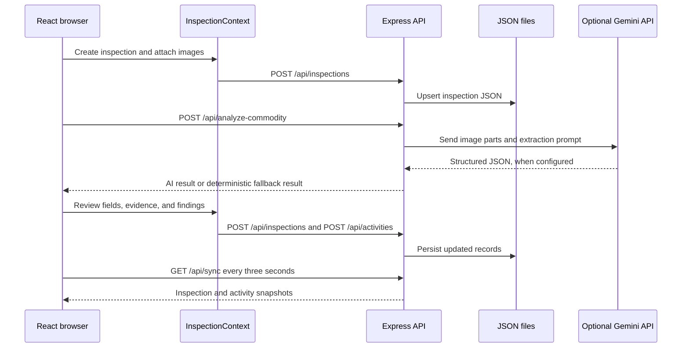
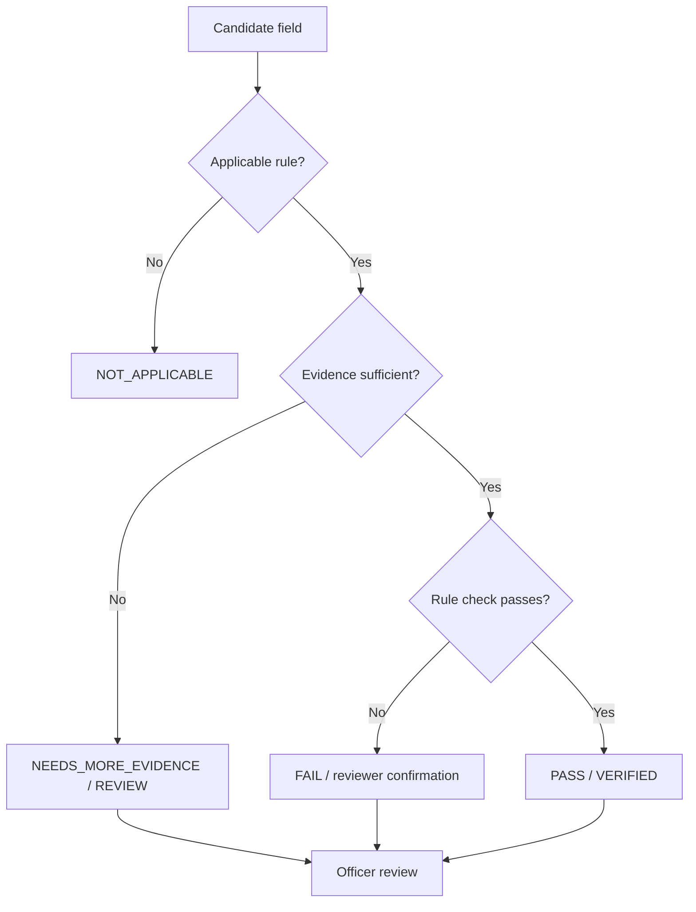
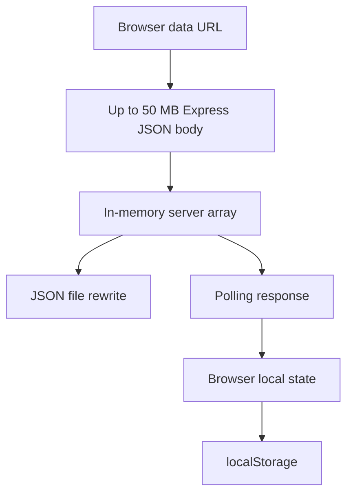

# METRIX — Digital Legal Metrology Inspector                                        

> **Evidence-backed inspection workspace for packaged-commodity verification and compliance reporting.**                
>
> The repository metadata identifies the application as **LabelLens — Digital Legal Metrology Inspector**, while the project and prototype UI use the **METRIX** name in several places. This README uses **METRIX** as the repository-facing name and calls out the branding difference where it matters.

[](https://react.dev/)
[](https://vite.dev/)
[](https://www.typescriptlang.org/)
[](https://expressjs.com/)
[](#project-status)

## Table of Contents

- [Overview](#overview)
- [Project Status](#project-status)
- [Problem Statement](#problem-statement)
- [Solution](#solution)
- [Features](#features)
- [Workflow](#workflow)
- [Architecture](#architecture)
- [End-to-End Pipeline](#end-to-end-pipeline)
- [Data Flow](#data-flow)
- [Core Logic and Rules](#core-logic-and-rules)
- [Technology Stack](#technology-stack)
- [Repository Structure](#repository-structure)
- [Prerequisites](#prerequisites)
- [Installation](#installation)
- [Configuration](#configuration)
- [Running the Application](#running-the-application)
- [Routes and Interface](#routes-and-interface)
- [API Reference](#api-reference)
- [Data Model](#data-model)
- [AI and Analysis Modes](#ai-and-analysis-modes)
- [Reports and Export](#reports-and-export)
- [Results and Evaluation](#results-and-evaluation)
- [Testing and Quality](#testing-and-quality)
- [Performance and Scalability](#performance-and-scalability)
- [Security, Privacy, and Compliance](#security-privacy-and-compliance)
- [Limitations and Known Issues](#limitations-and-known-issues)
- [Roadmap](#roadmap)
- [Contributing](#contributing)
- [License](#license)
- [Acknowledgements](#acknowledgements)
- [Author and Contact](#author-and-contact)
- [Project Summary](#project-summary)
- [References](#references) 

## Overview

METRIX is a browser-based inspection prototype for authorized Legal Metrology personnel. It supports a field-inspection workflow in which an officer records a business and commodity, captures package evidence, extracts candidate declarations, evaluates rule-oriented checks, reviews linked evidence, and generates an inspection report or dossier.

The application is designed around an **evidence-first** model. Extracted values are associated with source images, OCR blocks, bounding coordinates, findings, rule references, confidence levels, and review status. The system is assistive: it proposes extracted information and compliance observations, while the authorized officer remains responsible for the final review and determination.

The repository is a single full-stack web application. The browser UI is implemented with React and TypeScript. A Node-compatible Express server provides persistence, synchronization, health reporting, and the optional server-side Gemini analysis path.

## Project Status

This repository contains a working prototype and demonstration workflow, not a validated production enforcement system. The source includes implemented UI pages, rule-oriented analysis code, server endpoints, generated sample package imagery, PDF generation, and seeded benchmark data. It does **not** contain a formal accuracy benchmark, automated test suite, production identity provider, database migration system, or independently verified legal certification.

| Area | Status in repository |
| --- | --- |
| Inspector workflow | Implemented prototype flow |
| Admin dashboard | Implemented prototype flow |
| Image capture and upload | Implemented; camera permission is requested by the app metadata |
| OCR/vision analysis | Optional Gemini path plus deterministic fallback/demo analyzer |
| Rule evaluation | Implemented TypeScript rule and applicability logic |
| Evidence review | Implemented UI and state updates |
| JSON persistence | Implemented for inspections and activity events |
| PDF reporting | Implemented in browser-side services |
| Automated tests | No test files or test script are declared in `package.json` |
| Production authentication | Not implemented; current authentication is prototype-oriented |
| Production database | Not implemented; the server persists JSON files |
| Verified performance metrics | Not available in the repository |

## Problem Statement

Legal Metrology inspections of packaged commodities require an officer to examine product labels, capture evidence, verify mandatory declarations, record findings, and prepare a defensible report. The repository frames the problem around declarations such as manufacturer details, commodity name, net quantity, dates, maximum retail price, unit sale price, consumer-care information, country of origin, and display-panel typography.

Manual inspection can be difficult when labels contain small text, multiple panels, varying layouts, image glare, or uncertain declarations. A useful software assistant must therefore do more than display OCR text. It must preserve the relationship between a candidate value, its source image region, the applicable rule, the reviewer decision, and the final report.

## Solution

METRIX provides a role-aware inspection workspace with the following sequence:

1. Select an inspector or administrator workspace.
2. Create an inspection for a store and commodity.
3. Capture or upload package images, including front and back panels.
4. Run analysis through the optional Gemini multimodal endpoint or the deterministic fallback analyzer.
5. Normalize and evaluate extracted fields with statutory rule-oriented logic.
6. Review findings and evidence crops side by side.
7. Generate a Form 1-style inspection report or technical dossier PDF.
8. Synchronize inspection and activity data with the server and expose supervisory views to the admin workspace.

The application intentionally keeps the final decision with the human reviewer. It should not be treated as an autonomous legal authority.

## Features

### Inspector workspace

- Role-based inspector login flow.
- Store, business, commodity, jurisdiction, and inspection-context capture.
- New inspection creation with generated inspection identifiers.
- Camera capture and file-upload support for package evidence.
- Front, back, side, and price-closeup image roles in the domain model.
- Image preprocessing and evidence-review interfaces.
- Extracted-field review with confidence, source image, and bounding-box metadata.
- Finding review states including `PENDING`, `VERIFIED`, `NOT_APPLICABLE`, and `NEEDS_MORE_EVIDENCE`.
- Inspection history and dashboard views.
- Report preview and PDF export.

### Directorate/admin workspace

- Supervisory dashboard for team inspectors.
- Inspection and activity-ledger views.
- Inspector detail views and workload-oriented statistics.
- Cross-session synchronization through server polling and browser `BroadcastChannel` support.
- Prototype reset controls for clearing inspection and activity records.

### Analysis and compliance support

- Optional Gemini multimodal analysis through `POST /api/analyze-commodity`.
- Deterministic optical fallback when Gemini is unavailable or fails.
- Product-specific demo detection based on uploaded filename or image content markers.
- OCR blocks with normalized text, language, confidence, source image, and optional bounding box.
- Extracted statutory fields linked to front or back package evidence.
- Versioned rule metadata and applicability notes.
- Quantity parsing, date normalization, MRP parsing, USP calculation, and exemption evaluation.
- Findings with severity, status, evidence IDs, rule references, reviewer notes, and rule versions.

## Workflow



## Architecture

The repository uses a Vite-powered React client and an Express server started from `server.ts`. In development, Express mounts Vite middleware. In production, the server serves the built `dist` directory and falls back to `index.html` for the single-page application.



### Component responsibilities

| Component | Responsibility |
| --- | --- |
| `src/pages` | Public landing page, login pages, inspector workflow, admin views, settings, legal-metrology knowledge view, and report preview |
| `src/components` | Layout, authentication cards, evidence viewers, capture controls, workflow stepper, report canvas, status indicators, and reusable UI |
| `src/context/InspectionContext.tsx` | Central client state, local storage, routing, login state, inspection actions, server synchronization, and activity logging |
| `src/services/analysisPipeline.ts` | Deterministic regulatory analysis, rule registry, field extraction support, evidence linkage, and findings |
| `src/services/statutoryEngine.ts` | Date, MRP, quantity, USP, and statutory-exception logic |
| `server.ts` | Express API, JSON-file persistence, optional Gemini call, static serving, and development middleware |
| `data/*.json` | Server-side inspection and activity persistence files |
| `src/services/*Pdf.ts` | Browser-side report and technical dossier PDF generation |

## End-to-End Pipeline

```mermaid
flowchart LR
    A[Front/back package image] --> B[Image quality and preprocessing]
    B --> C{Gemini available?}
    C -->|Yes| D[Gemini multimodal JSON extraction]
    C -->|No or error| E[Deterministic optical fallback]
    D --> F[Detected product, OCR blocks, extracted fields]
    E --> F
    F --> G[Normalize dates, quantities, MRP, and USP]
    G --> H[Resolve applicability and exemptions]
    H --> I[Evaluate PCR-oriented checks]
    I --> J[Create PASS, FAIL, REVIEW, or NOT_APPLICABLE findings]
    J --> K[Link findings to evidence regions]
    K --> L[Human review and correction]
    L --> M[Persist inspection and activity]
    M --> N[Report preview and PDF export]
```



The source code contains two related analysis paths:

- `server.ts` sends image data URLs and product context to Gemini when `GEMINI_API_KEY` is available and returns structured JSON.
- If Gemini is unavailable or the call fails, the server uses a deterministic optical fallback with predefined product branches and generated OCR/evidence records.
- `src/services/analysisPipeline.ts` and `src/services/statutoryEngine.ts` apply client-side rule-oriented analysis and produce findings, evidence, applicability notes, and rule-version metadata.

## Data Flow



The browser also stores selected state in `localStorage` under versioned keys such as `metrix_inspections_live_v1`, `metrix_auth_live_v1`, and `metrix_activities_live_v1`. This is prototype persistence and is not a substitute for secure server-side session storage.

## Core Logic and Rules

### Rule registry

`src/services/analysisPipeline.ts` defines a registry for rule-oriented checks including:

- Rule 6(1)(a): manufacturer, packer, or importer name and address.
- Rule 6(1)(b): generic or common commodity name.
- Rule 6(1)(c): net quantity in standard units.
- Rule 6(1)(d): month and year of manufacture, packing, or import.
- Rule 6(1)(da): unit sale price.
- Rule 6(1)(e): MRP and tax-inclusion wording.
- Rule 6(1)(f): consumer grievance redressal details.
- Rule 13 / Schedule II: numeral font-height checks.

The rule registry stores identifiers, version strings, statutory source text, effective dates, applicability categories, package types, and exemptions. These are application rules implemented in TypeScript and require legal review before enforcement use.

### Statutory parsing and validation

`src/services/statutoryEngine.ts` implements:

- Date parsing for numeric dates, month/year formats, text month names, and some Roman-numeral month forms.
- MRP number extraction and detection of tax-inclusion phrases in English and Hindi text.
- Quantity parsing for common metric units and selected Hindi terms.
- Dynamic USP calculation by quantity unit and quantity threshold.
- Exemption evaluation for institutional packages, small quantities, agricultural bulk packages, and electronic products.
- A versioned ruleset model with entries for the PCR 2011 base, USP amendment, electronic-product amendment, and packaged-water/consumer-grievance rules.

### Review statuses and findings

The domain model distinguishes extracted-field status, confidence, evidence-review status, and finding status. This allows the UI to represent a candidate extraction separately from the officer’s verification decision.



## Technology Stack

| Layer | Verified technologies |
| --- | --- |
| Language | TypeScript, JavaScript, CSS |
| UI | React 19, React DOM, Lucide React, Motion |
| Build and development | Vite 6, TSX, esbuild, Tailwind CSS 4, `@tailwindcss/vite` |
| Server | Node-compatible Express 4, dotenv |
| AI integration | `@google/genai`; model name requested by the server is `gemini-3.8-flash` |
| Reports | `jspdf` and project PDF rendering services |
| Persistence | JSON files on the server; browser `localStorage` on the client |
| Synchronization | HTTP polling and browser `BroadcastChannel` |
| Package manager metadata | `bun.lock` is present; `package.json` scripts are runnable through npm-compatible tooling |
| Runtime port | `3000`, bound to `0.0.0.0` by `server.ts` |

## Repository Structure

```text
.
├── data/
│   ├── activities.json              # Server activity ledger
│   └── inspections.json             # Server inspection persistence
├── public/assets/
│   └── emblem-india.svg             # Public government-style emblem asset
├── src/
│   ├── components/                  # Layout, UI, auth, and workflow components
│   ├── context/
│   │   └── InspectionContext.tsx    # Global inspection/auth/sync state
│   ├── data/
│   │   └── seedData.ts              # Team records and benchmark package data
│   ├── pages/                       # Route-level application screens
│   ├── services/                    # Analysis, rules, image, and PDF services
│   ├── types/
│   │   └── index.ts                 # Domain types and status unions
│   ├── App.tsx                      # Client-side route selection
│   ├── index.css                    # Tailwind theme and global styling
│   └── main.tsx                     # React entry point
├── .env.example                     # Environment-variable template
├── index.html                       # Vite HTML entry point
├── metadata.json                    # App metadata and camera permission declaration
├── package.json                     # Scripts and dependencies
├── server.ts                        # Express/Vite server and API
├── tsconfig.json                    # TypeScript configuration
├── vite.config.ts                   # Vite and Tailwind configuration
└── PROJECT_RULES.md                 # Project-specific development rules
```

## Prerequisites

- Node.js compatible with the declared TypeScript and Vite toolchain.
- npm or another package manager capable of installing the dependencies in `package.json`.
- A modern browser with camera support if testing image capture.
- A Gemini API key only when using the optional Gemini analysis path.
- Write access to the repository directory because the server persists JSON data under `data/`.

The repository includes `bun.lock`, but Bun was not verified as part of this project inspection. The commands below use npm because the project manifest exposes standard npm-compatible scripts.

## Installation

```bash
git clone <repository-url>
cd <repository-directory>
npm install
cp .env.example .env
```

Do not commit `.env`. The `.gitignore` file should be reviewed before publishing or deploying the project to ensure secrets and generated data are excluded.

## Configuration

The repository provides `.env.example` with the following variables:

| Variable | Required | Purpose |
| --- | --- | --- |
| `GEMINI_API_KEY` | Optional | Enables the server-side Gemini multimodal analysis path. Without it, the deterministic fallback is used. |
| `APP_URL` | Present in template | Intended application URL for hosted environments. Its direct use should be verified before relying on it. |
| `PRASAD_ADMIN_PASSWORD` | Optional prototype setting | Administrator password source used by the prototype authentication helpers. |
| `NAVINYA_INSPECTOR_PASSWORD` | Optional prototype setting | Password source for the Navinya inspector account. |
| `SUDHANSHU_INSPECTOR_PASSWORD` | Optional prototype setting | Password source for the Sudhanshu inspector account. |
| `DEVANSH_INSPECTOR_PASSWORD` | Optional prototype setting | Password source for the Devansh inspector account. |
| `NIRMITI_INSPECTOR_PASSWORD` | Optional prototype setting | Password source for the Nirmiti inspector account. |
| `KSHITIJA_INSPECTOR_PASSWORD` | Optional prototype setting | Password source for the Kshitija inspector account. |

Example development configuration:

```dotenv
GEMINI_API_KEY=replace-with-a-secret
APP_URL=http://localhost:3000
PRASAD_ADMIN_PASSWORD=replace-with-a-development-password
NAVINYA_INSPECTOR_PASSWORD=replace-with-a-development-password
SUDHANSHU_INSPECTOR_PASSWORD=replace-with-a-development-password
DEVANSH_INSPECTOR_PASSWORD=replace-with-a-development-password
NIRMITI_INSPECTOR_PASSWORD=replace-with-a-development-password
KSHITIJA_INSPECTOR_PASSWORD=replace-with-a-development-password
```

The current source also contains prototype/demo password fallbacks and stores authentication state in `localStorage`. These behaviors must be removed or replaced before production deployment; see [Security, Privacy, and Compliance](#security-privacy-and-compliance).

## Running the Application

### Development

```bash
npm run dev
```

The Express server starts on port `3000` and mounts Vite middleware for the development client.

Open <http://localhost:3000> in a browser.

### Type checking

```bash
npm run lint
```

The `lint` script currently runs `tsc --noEmit`; it is a TypeScript check rather than a formatter or ESLint command.

### Production build

```bash
npm run build
NODE_ENV=production npm start
```

The build creates the Vite client output and bundles `server.ts` to `dist/server.cjs`. In production mode, the server serves static files from `dist` and routes unknown paths to `dist/index.html`.

### Other scripts

| Script | Command | Purpose |
| --- | --- | --- |
| `dev` | `tsx server.ts` | Start the development server with Vite middleware |
| `build` | `vite build && esbuild ...` | Build the client and bundle the server |
| `start` | `node dist/server.cjs` | Start the production bundle |
| `preview` | `vite preview` | Preview the Vite build directly |
| `clean` | `rm -rf dist server.js` | Remove selected generated files |
| `lint` | `tsc --noEmit` | Type-check without emitting files |

## Routes and Interface

The client uses route selection through `InspectionContext` and URL-hash/path state rather than a separately declared router package.

| Route | Purpose |
| --- | --- |
| `/` or `/home` | Public landing page |
| `/legal-metrology` | Legal Metrology knowledge/reference page |
| `/login` | Role selection |
| `/login/inspector` | Inspector login |
| `/login/admin` | Administrator login |
| `/dashboard` | Inspector dashboard fallback/workspace |
| `/inspections` | Inspection history |
| `/inspections/new` | New inspection details |
| `/inspections/:id/upload` | Product image upload/capture |
| `/inspections/:id/analyzing` | Analysis progress screen |
| `/inspections/:id/result` | Analysis result screen |
| `/inspections/:id/evidence` | Evidence and finding review |
| `/inspections/:id/report` | Report preview |
| `/settings` | Inspector settings |
| `/admin` or `/admin/dashboard` | Administrator dashboard |
| `/admin/inspectors/:id` | Administrator inspector detail |
| `/admin/inspections`, `/admin/activity`, `/admin/reports` | Administrator views |
| `/admin/settings` | Administrator settings |

## API Reference

The Express server exposes a small JSON API. There is no OpenAPI specification in the repository, so the examples below are derived from `server.ts` and should be kept synchronized with the implementation.

### Health

```http
GET /api/health
```

Returns service status, timestamp, record counts, and the last update time.

### Inspections

```http
GET /api/inspections
Content-Type: application/json
```

Returns the persisted inspection array.

```http
POST /api/inspections
Content-Type: application/json

{
  "id": "INS-EXAMPLE-001",
  "status": "DRAFT"
}
```

Accepts one inspection object or an array of objects. Each object must include an `id`; existing IDs are merged and new IDs are inserted.

```http
DELETE /api/inspections/INS-EXAMPLE-001
```

Deletes one inspection. The server refuses deletion of the benchmark inspection identified by `DEMO_INSPECTION.id`.

### Activities

```http
GET /api/activities
```

Returns the activity ledger.

```http
POST /api/activities
Content-Type: application/json

{
  "userId": "NAVINYA_INS_02",
  "userName": "Navinya",
  "type": "inspection_created",
  "description": "Created inspection"
}
```

The server adds an `activityId` and timestamp when they are not supplied and keeps the most recent 100 activities.

### Synchronization

```http
GET /api/sync
```

Returns `inspections`, `activities`, and `lastUpdated` in one response. The client polls this endpoint every three seconds and also refreshes on window focus.

### Commodity analysis

```http
POST /api/analyze-commodity
Content-Type: application/json

{
  "inspectionId": "INS-EXAMPLE-001",
  "frontImage": {
    "id": "IMG-FRONT",
    "filename": "package-front.jpg",
    "mimeType": "image/jpeg",
    "dataUrl": "data:image/jpeg;base64,..."
  },
  "backImage": {
    "id": "IMG-BACK",
    "filename": "package-back.jpg",
    "mimeType": "image/jpeg",
    "dataUrl": "data:image/jpeg;base64,..."
  },
  "product": {
    "name": "Retail Commodity",
    "brand": "",
    "declaredQuantity": ""
  }
}
```

The response includes `success`, `analysisMode`, `detectedProduct`, `ocrBlocks`, `extractedFields`, and `summaryNotes`. The endpoint accepts large JSON bodies because images are sent as data URLs. This is convenient for the prototype but is not an efficient production upload design.

### Reset

```http
POST /api/reset
```

Clears server-side inspection and activity arrays and persists the empty state. Protect this endpoint before deploying beyond a controlled prototype environment.

## Data Model

The primary domain entity is `Inspection` in `src/types/index.ts`.

| Entity | Important fields |
| --- | --- |
| `Inspection` | ID, status, date, inspector, jurisdiction, business, product, images, extracted fields, findings, evidence, OCR blocks, rule version, notes, timestamps |
| `ProductImage` | ID, filename, role, dimensions, capture source, data URL, MIME type, upload timestamp |
| `ExtractedField` | Name, value, raw text, source, status, confidence, source image, optional bounding box |
| `OCRBlock` | Original and normalized text, language, confidence, source image, optional bounding box |
| `Finding` | Severity, title, description, related field, confidence, evidence IDs, review status, rule reference, reviewer metadata |
| `EvidenceItem` | Source image, label, description, region, linked findings, confidence, review status, reviewer metadata |
| `ActivityEvent` | User, inspection, event type, description, activity ID, timestamp |
| `Inspector` / `Admin` | Identity, designation, jurisdiction, role, and contact fields |

Inspection statuses are `DRAFT`, `PROCESSING`, `REVIEW_REQUIRED`, `REPORT_READY`, `VERIFIED`, and `CLOSED`.

## AI and Analysis Modes

### Gemini-assisted mode

When `GEMINI_API_KEY` is available and at least one image data URL is supplied, the server sends the image parts and a structured extraction prompt to the configured Gemini client. The prompt requests multilingual extraction for English, Hindi, and Marathi labels, product identification, statutory fields, OCR blocks, confidence, and bounding boxes.

The source requests the model name `gemini-3.8-flash`. Confirm model availability and policy suitability in the deployment environment before relying on this path.

### Deterministic fallback mode

If the Gemini client is unavailable or its request fails, the server returns `OPTICAL_SCANNER` output. The fallback uses deterministic branches based on image data or filenames for several demo commodity examples and otherwise uses supplied product context. It emits generated OCR blocks, fields, and statutory-looking values for the prototype flow.

This fallback is useful for demonstrations and offline development. It is **not** a general-purpose OCR engine and must not be described as validated recognition of arbitrary packaging.

### Client-side rule analysis

The client-side analysis pipeline applies deterministic parsing and rule evaluation to construct findings and evidence. It includes rule-version fields and applicability notes so the UI can present the basis for review.

## Reports and Export

The repository includes:

- `src/services/inspectionReportPdf.ts` for inspection-report PDF generation.
- `src/services/technicalDossierPdf.ts` for a technical dossier PDF.
- `src/components/ui/ReportCanvas.tsx` and `src/pages/ReportPreviewPage.tsx` for report presentation.
- Print CSS in `src/index.css` for A4-oriented output and removal of non-print UI elements.

The generated documents are prototype outputs. Their legal status, signature process, QR verification, and official form conformity require review before operational use.

## Results and Evaluation

The repository includes one reference benchmark inspection and generated demo package artwork in `src/data/seedData.ts`. It does not include a labeled dataset, confusion matrix, OCR accuracy score, rule-precision study, latency benchmark, throughput benchmark, or independent validation report.

Accordingly, no accuracy or performance numbers are claimed here. A suitable evaluation plan for future work would measure:

1. Field-level extraction precision and recall against a labeled package-image set.
2. Bounding-box localization quality for each mandatory declaration.
3. Rule-evaluation precision, recall, and false-review rate by commodity category.
4. Date, quantity, MRP, and USP parsing accuracy across scripts and formats.
5. End-to-end review time with and without the assistant.
6. API latency, memory use, image-size limits, and concurrent-user behavior.
7. Reviewer agreement and correction rates for AI-assisted findings.

## Testing and Quality

The repository declares a TypeScript check through:

```bash
npm run lint
```

No Jest, Vitest, Playwright, Cypress, Mocha, or other automated test command is declared in `package.json`, and no test directory was present in the inspected tree. Validation is therefore currently based on type checking, manual UI testing, prototype field testing, and the seeded benchmark flow.

Before accepting production changes, add unit tests for statutory parsing and USP calculation, integration tests for each API endpoint, component tests for review-state transitions, browser tests for the capture-to-report flow, and security tests for authentication and administrative actions.

## Performance and Scalability

The repository does not provide verified response-time, throughput, memory, cost, or accuracy measurements. The current design has several known scaling constraints:

- Images are embedded as data URLs in JSON request bodies.
- Express accepts request bodies up to 50 MB.
- Inspections and activities are held in server memory and rewritten to JSON files.
- The client polls `/api/sync` every three seconds.
- The server keeps only the latest 100 activity events.
- There is no database index, queue, object storage layer, worker pool, rate limiter, or cache implementation in the repository.

A production deployment should use object storage for images, a transactional database for inspections and audit events, authenticated incremental synchronization, background analysis jobs, bounded retries, observability, and load testing.

The current data flow can be summarized as:



## Security, Privacy, and Compliance

### Implemented safeguards and boundaries

- Gemini access is initialized in `server.ts`, keeping the API key out of the browser-side analysis request path.
- Admin routes are guarded by the current client role in `App.tsx`.
- Inspector views filter real inspections by the current inspector ID in `InspectionContext.tsx`.
- The benchmark inspection is protected from deletion by the server endpoint.
- The UI states that the assistant does not replace the authorized officer’s legal authority.

### Current security risks

- Authentication state is stored in browser `localStorage`.
- The source contains prototype/demo password fallbacks in client code.
- The API has no server-side session verification or authorization middleware.
- `/api/reset` is not protected by an authenticated server-side role check.
- JSON files are not a transactional or concurrent-safe persistence layer.
- Images and inspection data may contain sensitive evidence and are sent as large request bodies.
- The repository’s sample data contains personal-looking names, email addresses, phone numbers, and locations. Treat these as demo data and replace or anonymize them before publication.
- No CSRF protection, rate limiting, audit-integrity mechanism, field-level encryption, or structured secret-management integration is implemented.

### Production hardening requirements

Before deployment with real inspection records, implement server-side identity and access management, secure cookies or short-lived tokens, authorization on every API route, input validation, upload validation, malware scanning, encryption in transit and at rest, database-backed audit logs, retention policies, privacy review, rate limiting, structured logging, secret rotation, and security testing.

This project should be treated as a **prototype inspection assistant**, not as a certified legal decision system.

## Limitations and Known Issues

- The Gemini path depends on an external model and a model name that must be verified in the target environment.
- The fallback analyzer is deterministic demo logic, not general OCR.
- Legal rule implementations are application code and require domain-expert validation against the authoritative and current regulatory text.
- The source contains multiple branding references, including METRIX and LabelLens.
- The `package.json` package name remains `react-example`, which should be renamed for publication.
- The server uses JSON files rather than a production database.
- There is no migration, backup, retention, or conflict-resolution strategy for persisted records.
- Authentication is prototype-oriented and not production secure.
- The API has no generated OpenAPI specification.
- No automated test suite or verified benchmark metrics is included.
- The application sends image data as data URLs, increasing request size and memory pressure.
- The current route handling is custom and should be tested carefully under direct-link, refresh, and reverse-proxy deployments.

## Roadmap

The following roadmap is proposed based on the current repository gaps and should not be read as completed functionality.

### Near term

- Standardize the product name and package metadata.
- Remove hard-coded/demo credential fallbacks.
- Add schema validation for API payloads and environment variables.
- Add unit and integration tests for the rule engine and server endpoints.
- Add a clear development seed/reset workflow that cannot affect production data.
- Add an OpenAPI document and generated API client types.

### Medium term

- Replace JSON persistence with a transactional database.
- Store images in object storage and reference them by immutable IDs.
- Add server-side sessions or an external identity provider with role-based authorization.
- Move AI analysis to a background job with progress, retries, timeouts, and audit records.
- Build a labeled evaluation set for OCR, field extraction, evidence localization, and rule outcomes.
- Add observability, rate limiting, structured logs, and operational dashboards.

### Long term

- Expand category-specific rule packs under a formal legal-review process.
- Support rule-pack effective dates and amendment provenance with automated regression tests.
- Add reviewer agreement and calibration workflows.
- Validate multilingual recognition across representative scripts and packaging conditions.
- Complete privacy, security, accessibility, and deployment certification activities appropriate to the operating authority.

## Contributing

Contributions should preserve the evidence-first design and should not turn probabilistic extraction into an autonomous legal decision. A recommended contribution workflow is:

```bash
git checkout -b feature/short-description
npm install
npm run lint
npm run build
```

Before opening a pull request:

- Explain the user or inspection problem being addressed.
- Identify changed routes, API contracts, domain types, and rule behavior.
- Add or update tests for parsing, rule evaluation, state transitions, and API changes.
- Do not commit `.env`, API keys, real credentials, private inspection imagery, or personal data.
- Document any legal or domain assumption and identify the authoritative source that should be reviewed.
- Include screenshots or a short manual test procedure for UI changes.
- Keep changes focused and preserve existing accessibility and reduced-motion behavior.

Issues should include the runtime, browser, reproduction steps, sample input that is safe to share, expected behavior, actual behavior, and relevant logs with secrets removed.

## License

No `LICENSE` file or license declaration was present in the inspected repository. The project should not be redistributed as open source until the copyright holder adds an explicit license. Until then, default copyright restrictions apply.

## Acknowledgements

The repository directly uses or declares the following technologies and project components:

- React, React DOM, TypeScript, and Vite for the application and build toolchain.
- Express and TSX for the server and development runtime.
- Tailwind CSS and `@tailwindcss/vite` for styling.
- Lucide React and Motion for interface icons and animation.
- Google GenAI for the optional server-side multimodal analysis integration.
- jsPDF for PDF generation.
- Legal Metrology (Packaged Commodities) Rules, 2011 terminology and rule references as represented in the application source.

Additional external standards, datasets, or official organizational affiliations should be added only after their provenance is verified.

## Author and Contact

The repository does not declare a verified author, organization, public project URL, or maintained support address. The email-like values in demo seed data should not be treated as project contact information.

Before publication, replace this section with verified details:

- **Maintainer:** To be specified
- **Organization or team:** To be specified
- **Repository:** To be specified
- **Issue tracker:** To be specified
- **Contact email:** To be specified

## Project Summary

METRIX is a prototype evidence-backed inspection workspace for packaged-commodity label review. It combines a React field workflow, image evidence capture, optional Gemini-assisted extraction, deterministic parsing and rule evaluation, human review, server synchronization, and PDF reporting. Its strongest architectural idea is the linkage between extracted values, source evidence, rule applicability, reviewer decisions, and report output.

The project is not yet production-ready for official enforcement. The next critical steps are to secure authentication and authorization, replace JSON persistence, add automated tests and measured evaluation, validate the legal rule packs, and establish verified ownership and licensing.

## References

[1]: https://react.dev/ "React documentation"
[2]: https://vite.dev/ "Vite documentation"
[3]: https://www.typescriptlang.org/docs/ "TypeScript documentation"
[4]: https://expressjs.com/ "Express documentation"
[5]: https://tailwindcss.com/docs "Tailwind CSS documentation"
[6]: https://ai.google.dev/gemini-api/docs "Google Gemini API documentation"
[7]: https://github.com/parallax/jsPDF "jsPDF repository"
[8]: https://github.com/mermaid-js/mermaid "Mermaid documentation and repository"
[9]: https://legislative.gov.in/ "Legislative Department, Government of India"
